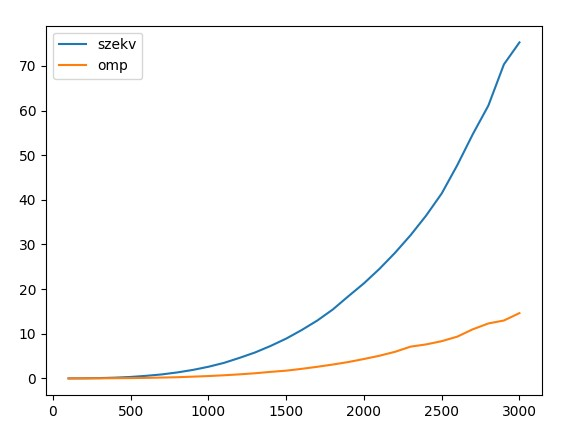
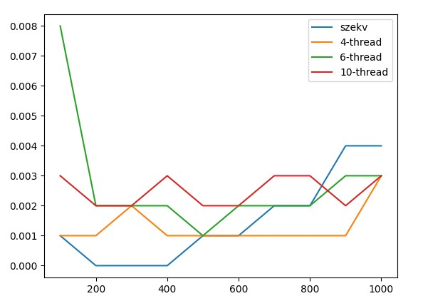
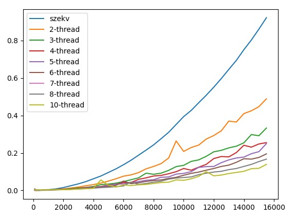
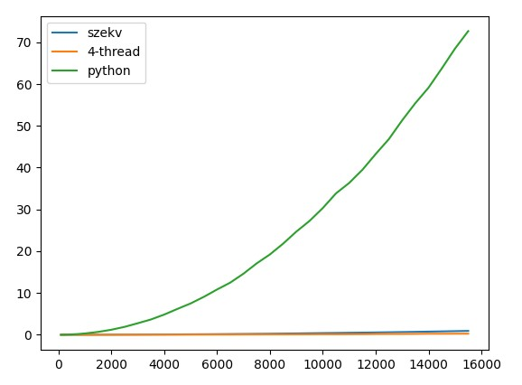
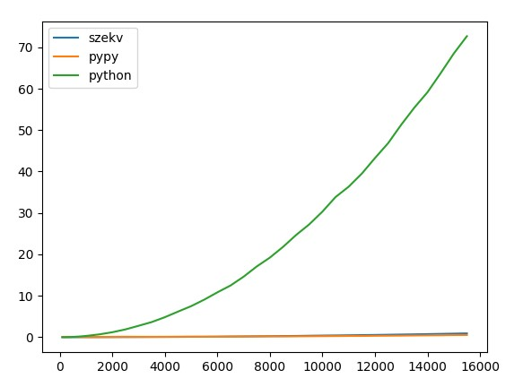

# FÉLÉVES FELADAT

## Gauss-Jordan OMP

Az OpenMP segítségével implementált Gauss-Jordan elimináció egyenletrendszerek megoldására "nxm" méretű mátrixok esetén.

### Megjegyzések:
- A szekvenciális és OpenMP megoldások összehasonlítása alapján megfigyelhető, hogy minél nagyobb a mátrix mérete, annál nagyobb a párhuzamosításból származó gyorsulás.

### Grafikon:

*A grafikon megmutatja a Gauss-Jordan elimináció sebességét az OpenMP párhuzamosítással különböző méretű mátrixok esetén. Az x tengelyen a mátrix mérete (N) van, míg az y tengelyen az eltelt idő másodpercben. Az összehasonlítás segít megérteni, hogy hogyan skálázódik a párhuzamosítás a méret növekedésével.*

## Infinity-Norm Pthread/Python

A végtelen norma kiszámítása során Pthread és Python megoldásokat is vizsgáltunk.

### Megjegyzések:
- Kisebb méretű mátrixok esetén megfigyelhető, hogy a Pthread megközelítés hatékonyabb, míg nagyobb méretű mátrixok esetén a Python megoldás lassabb.
- A PyPy használata esetén a Python implementáció közelít a Pthread megközelítés sebességéhez.

### Grafikonok:
- Kisebb méretű mérések:
  
  

  *A grafikon mutatja a kisebb méretű mátrixok végtelen normájának számításának sebességét Pthread és Python megközelítésekkel. Az x tengelyen a mátrix mérete (N) van, míg az y tengelyen az eltelt idő másodpercben.*
  
- Nagyobb méretű mérések:
  
  

  *A grafikon mutatja a nagyobb méretű mátrixok végtelen normájának számításának sebességét Pthread és Python megközelítésekkel. Az x tengelyen a mátrix mérete (N) van, míg az y tengelyen az eltelt idő másodpercben.*

- Pythonban történő multithreading mérései:
  
  

  *A grafikon mutatja a végtelen norma kiszámításának sebességét Python multithreading használatával. Az x tengelyen a mátrix mérete (N) van, míg az y tengelyen az eltelt idő másodpercben.*

- PyPy fordítóval történő Python mérései:
  
  

  *A grafikon mutatja a végtelen norma kiszámításának sebességét PyPy fordítóval Pythonban. Az x tengelyen a mátrix mérete (N) van, míg az y tengelyen az eltelt idő másodpercben.*

## Mérési Adatok

A mérések során az alábbi adatokat rögzítettük:

- **Gauss-Jordan OpenMP:**
  - 1000x1000-es mátrix esetén: Szekvenciális - 1.736 másodperc, OpenMP - 0.302 másodperc
  - 3000x3000-es mátrix esetén: Szekvenciális - 14.628 másodperc, OpenMP - 72.684 másodperc

- **Infinity-Norm Pthread/Python:**
  - 1000x1000-es mátrix esetén: Pthread - 0.004 másodperc, Python - 0.059 másodperc, PyPy - 0.302 másodperc
  - 15500x15500-es mátrix esetén: Pthread - 0.922 másodperc, Python - 0.528 másodperc, PyPy - 72.684 másodperc

Az eredmények másodpercben vannak kifejezve, és jól mutatják a párhuzamosítás és a programnyelvek közötti különbségeket különböző méretű mátrixok esetén.
